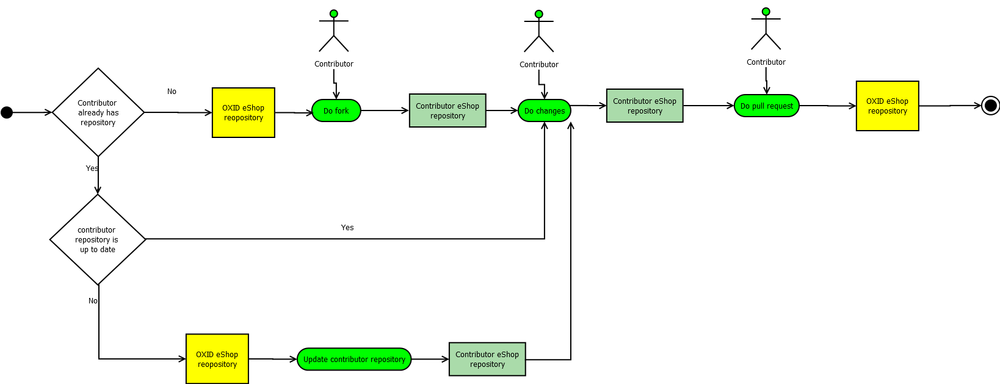

# Getting involved

OXID eShop is available under two different licenses, GPLv3 and a commercial license.

That's why, before contributing for the first time, you must <a href="https://gist.github.com/OXID-Admin/6df6ed126d074a54507d">sign the Contributor License Agreement</a>.
You can find more information about it on the FAQ page OXID Contribution and Contributor Agreement FAQ:
https://oxidforge.org/en/oxid-contribution-and-contributor-agreement-faq

## Process

First off, you have to fork the repository OXID-eSales/oxideshop_ce to your list of repositories.

To find the correct branch to contribute to, read this introduction to our branch naming strategy:

As the oxideshop_ce core component follows semantic versioning, the version number of the tagged releases differ from the OXID eShop Compilation.
Understanding this is important, because the branches do not relate to the oxideshop_ce core component version, but to the compilation version.

You will find the three following branch types in *\<github_username\>/oxideshop_ce* repository:

* The **development** branch is always named **master** and represents the next major version: All new features including compatibility breaking changes will be developed here as well as bug fixes.
* The **maintenance** branch with a name like **b-6.x** for the currently maintained major version, in this case for the OXID eShop Compilation V6. Only Backwards compatible changes as well as new compatible features are possible. From this we can provide the next minor version.
* The **legacy** branch with a name like **b-6.0.x** for an already released minor version (will only be created if needed): fixes for critical bugs only.

In general, contributions can be taken over for all branches. Bug fixes committed to only one branch will be pushed to the other branches manually. Of course you can also consider to commit e.g. bug fixes to more than one branch.

## Development installation

1. make sure [composer](https://getcomposer.org/) is installed on your system
2. `$ git clone https://github.com/OXID-eSales/oxideshop_ce.git`
3. `$ cd oxideshop_ce`
4. `$ composer install --no-dev`
5. `$ cp source/config.inc.php.dist source/config.inc.php`

If you want to install OXID eShop including example data like products, categories etc., you first need to install the demo data package:

1. `$ composer require --no-update oxid-esales/oxideshop-demodata-ce:dev-b-6.0`
2. `$ composer update --no-dev`

### Cloning without history

To reduce the size of the repository when cloning you can use a so called "shallow clone".
With it, the history will be truncated and can save more than 90% of the disk space and traffic in comparison to a full repository clone.

Here is an example of how to use a shallow clone:

`git clone --depth 1 https://github.com/OXID-eSales/oxideshop_ce.git`

## Best practice

* please leave the the branch names as they are
* if you want to fix a bug or develop a new feature, define an own branch in your repository off of one of the three branches above. Name it e.g. feature/foo or bug/bugname for better tracability
* change whatever you want and push it to your forked repository
* when changes are pushed, create a Pull request on github for your branch
* additional changes to pull request can be done by making additional commits on your branch

For more information about this, please see: 
http://codeinthehole.com/writing/pull-requests-and-other-good-practices-for-teams-using-github/

Now you'll be asked for signing an OXID Contributor Agreement (this has to be done once). After that we can start checking your code. In every case, whether or not we could take over your contribution, you'll be informed.

When sending your pull request, please provide a clear, meaningful and detailed information what your code is about and what it will do, best including a screen shot if possible.
If you want to discuss your contribution and your code before committing it, please go to the dev-general mailing list: https://lists.oxidforge.org/mailman/listinfo/dev-general.

You will find technical help with Git and GitHub on this place: 
https://help.github.com/

## Code quality

Please find a collection of helpful development tools as well as a link to the OXID specific Coding style guidelines at https://oxidforge.org/en/coding-standards.html.
We also kindly request to PHP Unit tests for your code.